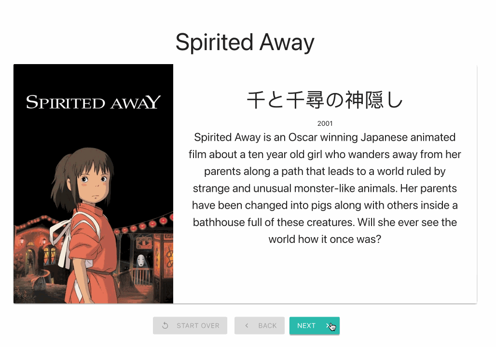

# React Slideshow

For this project you will build a component that allows a user to progress through a set of data, one item at a time.

The user will be able to navigate through a slideshow showing information about the films of Hayao Miyazaki.

Each "slide" should show the title of the film, the original title of the film in Japanese, the movie poster image, the film's release date, and description text about the film.

Data is provided in a file, but its original source is the [Studio Ghibli API](https://ghibliapi.herokuapp.com/).

## Skills you're building in this project

When you have finished this project, you will...

- know how to build a component that advances through a set of data showing one item at a time, using buttons to navigate and restart
- gain experience using state in React
- gain experience using click events in React
- gain experience using props to pass data from a parent component to a child component

## Requirements

- When the page loads, the user should see the first slide.
- A user can see the next slide in the slideshow when the next button is clicked.
- A user can go back to the previous slide in the slideshow when the back button is clicked.
- A user can start over from the beginning when the Start Over button is clicked.
- A user should not be able to click on the Next button when the slide is the last one (because the button is disabled).
- A user should not be able to click on the Back button when the slide is the first one (because the button is disabled).
- A user should not be able to click on the Start Over button when the slide is the first one (because the button is disabled).
- The application should be styled, but it can be very simple. You can use a library if you want to (lightweight ones like Bulma or Materialize are good options), but your focus should be on functionality.

### Here is an example of how the finished app works

## How to Start

This repo contains a React app created with `create-react-app`. You should clone this repo and then run `npm install` in the directory where the package.json is.

You can run the application using `npm start`.

- Create a component called `Slideshow` in a file called `Slideshow.js`. You will need to write all the code for the slideshow in this component.
  - Optionally, you might choose to also make a Slide component, but it's not necessary to make this work.
- App.js should render the `Slideshow` component.
- Pass the slide data in as a prop from App.js, where the data is already being imported, to the `Slideshow` component. The data can then be used in the `Slideshow` component.
- Figure out what you want the UI to look like. What HTML will the JSX need to include?
- Think and talk about how you will make it possible to show a single film in the ui. How could this work?
- Once you have one film showing in the UI, consider how you will make the ui change to show the next film.

## 🌶️ Spicy options

- Create a sort button that allows a user to view the slides in order by release date.
- Create a Go To feature: an input field that lets a user type in the number of the slide they want to go to and the UI shows that slide immediately. Bonus: find a way to let the user go back to the slide they were on before they used Go To, even if it is not the one right before the current slide (i.e.: if a user is on slide 2, and then uses Go To to slide 7, they have an option to return to slide 2 instead of slide 6. Your UI should make this option clear to the user.)
- Add [pagination](https://bulma.io/documentation/components/pagination/) [links](https://materializecss.com/pagination.html#!) to navigate through the content.
- Instead of showing one film at a time, show a list of 10 films on each slide (or "page"). A longer data file with many more Studio Ghibli films is provided, so you can swap it in for `film-data.json`. You should provide [pagination links](https://developer.mozilla.org/en-US/docs/Web/CSS/Layout_cookbook/Pagination) to the user.
- Replace the data file with [API data](https://ghibliapi.herokuapp.com/). You'll need to use the `useEffect()` hook from React to make this work.
- Imagine that this data was not being provided in a file, but was being requested from an external API. Handle a case when the data passed in as a prop contains 0 slides.
